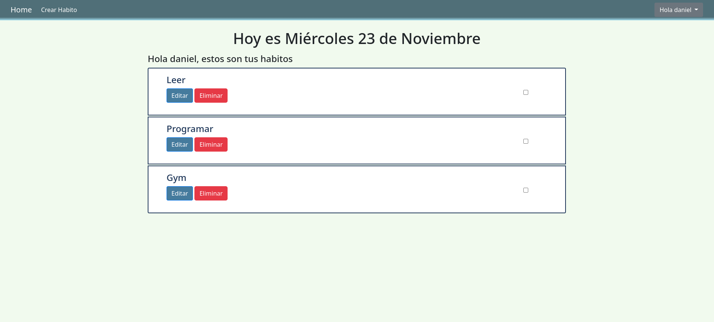
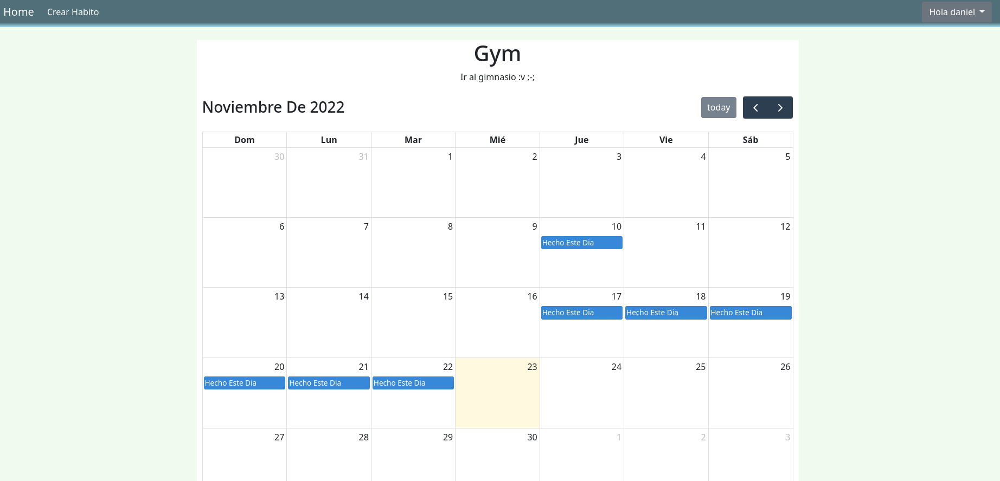
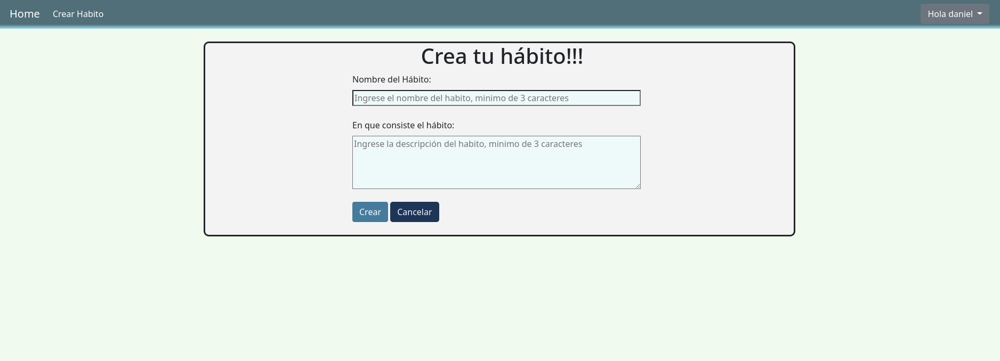

# Habit tracker in Django
Habit tracker app with Calendar made with Django.

Home:


Gym habit:


Create habit:


To clone and run the project:
```bash
git clone git@github.com:DaniDiazTech/Habit-tracker.git
cd Habit-tracker
python -m venv .venv
source .venv/bin/activate
pip install -r requirements.txt
python manage.py migrate
python manage.py runserver
```

To run the project:

```bash
django-admin startproject --template=https://github.com/momentumlearn/django-project-template/archive/main.zip --name=Pipfile project .
python -m venv .venv
source .venv/bin/activate
pip install -r requirements.txt
python manage.py migrate
python manage.py runserver
```
